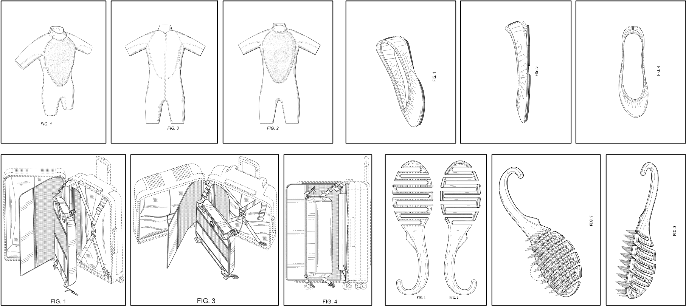
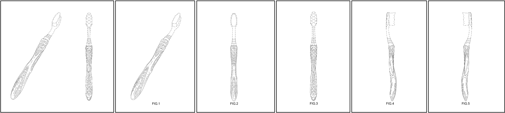
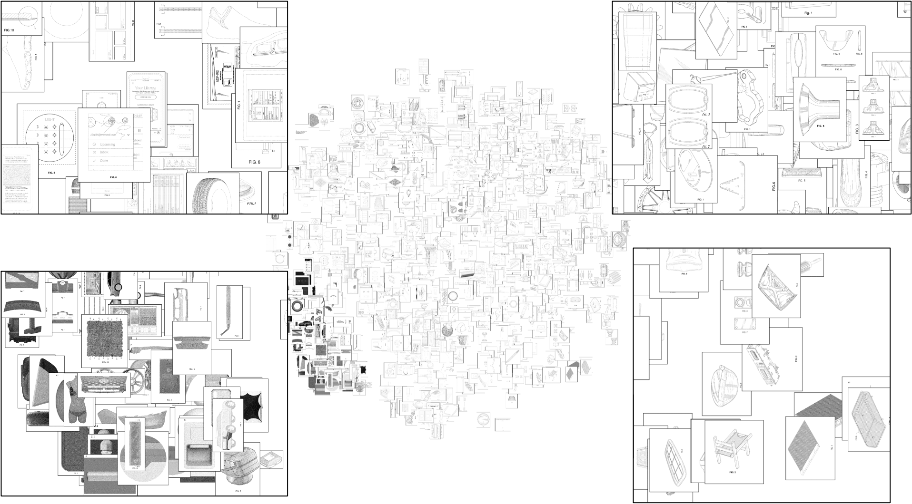
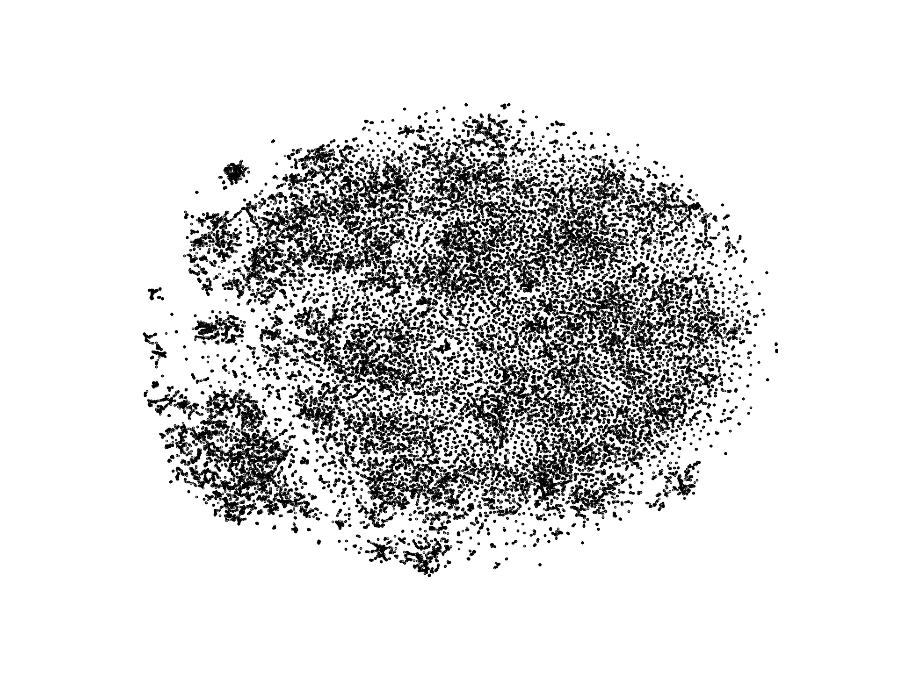

# DeepPatent Dataset

In this repository, we provide the dataset of patent images and a baseline retrieval model as described in the following paper:

Michal Kucer, Diane Oyen, Juan Castorena, and Jian Wu. **DeepPatent: Large scale patent drawing recognition and retrieval.** WACV 2022. [[PDF]](https://openaccess.thecvf.com/content/WACV2022/papers/Kucer_DeepPatent_Large_Scale_Patent_Drawing_Recognition_and_Retrieval_WACV_2022_paper.pdf) 

    @InProceedings{Kucer_2022_WACV,
    author    = {Kucer, Michal and Oyen, Diane and Castorena, Juan and Wu, Jian},
    title     = {DeepPatent: Large Scale Patent Drawing Recognition and Retrieval},
    booktitle = {Proceedings of the IEEE/CVF Winter Conference on Applications of Computer Vision (WACV)},
    month     = {January},
    year      = {2022},
    pages     = {2309-2318}
    }

The dataset consists of over 350,000 public domain patent drawings collected from the United States Patent and Trademark Office (USPTO). The whole collection consists of a total of 45,000 design patents published between January 2018 and June 2019. 

## Example images from the dataset

## Get the Dataset
The DeepPatent dataset can be found on **[Google Drive](https://drive.google.com/drive/folders/1hCcqD8W_f4B1UktqlGlBgDSwReCf5TSO?usp=sharing)**. The dataset has been compressed and split into 9 parts (aa-ai). To decompress the dataset, please download all of the parts into a single folder and combine them into a single archive using the following command (MacOS / Linux):

    cat patent_data.part?? > DeepPatent.tar.gz

The DeepPatent.tar.gz can then be be extracted to a folder of your choosing. 

The "data" folder contains the relevant splits that were used in our paper. 
We randomly sample 15 % of the patents (6927 patents), and set them aside for testing. The rest of patents patents are further subdivided into a training and validation patent sets with a total of 33364 and 5888 patents respectively. The following files are contained in the folder:

* train_patent_trn.txt
* train_patent_val.txt
* val_query_patent.txt
* val_db_patent.txt
* test_query_patent.txt
* test_db_patent.txt
* test_db_patent_extended.txt

Note that the lists in the *data* folder have partial links to the files, so it will be important for you to add the root path (where the dataset was extracted) to the command-line arguments when running the code.

## Evaluating PatentNet on the DeepPatent test split (with out query / database splits)

### Prerequisites
In order to run the testing scripts, you will need:
* Python3 (tested with Python 3.7.9)
* PyTorch (tested with Pytorch 1.8 and 1.8.1+cu102)
* numpy, matplotlib, tqdm, scikit-learn
* Deep Image Retrieval (dirtorch - see instuctions)

For the Python packages, with conda run the following commands:

    conda install numpy matplotlib tqdm scikit-learn
    conda install pytorch torchvision -c pytorch

For Deep Image Retrieval (dirtorch), you can download the **[deep-image-retrieval repository](https://github.com/naver/deep-image-retrieval)**, and extract it to the src folder. Alternatively, you can use the a version included in the src folder already.

### Installation
Download this repository:

    git clone https://github.com/GoFigure-LANL/DeepPatent-dataset.git

Make sure to include the *dirtorch* parent-folder path in the PYTHONPATH:

    export PYTHONPATH=$PYTHONPATH:/path/to/src

The *dirtorch* repo requires a DB_ROOT for their datasets. Though the script does not utilize it, as the repo expects it, set it to a dummy path of your choosing, e.g.

    export DB_ROOT=/path/to/dummy/folder

### Running PatentNet on the test set

To reproduce our best results, (1) download our best model, PatentNet_Tri_GeM.pth.tar, from Google Drive **[Google Drive](https://drive.google.com/drive/folders/1hCcqD8W_f4B1UktqlGlBgDSwReCf5TSO?usp=sharing)**; and (2) run *test_dir_patents.py* as follows:

    python /path/to/deeppatent-dataset/code/test_dir_patents.py \
        --dataset /path/to/dataset/root \
        --arch="resnet50_rmac" \
        --checkpoint /path/to/PatentNet/PatentNet_Tri_GeM.pth.tar \
        --image_size=256 \
        --gpu 0

## Preparing a submission for the ECCV 2022 DIRA Workshop Data Challenge

In this section we include instructions on how to prepare a submission for the ECCV 2022 DIRA Workshop Data Challenge hosted on **[CodaLab](https://codalab.lisn.upsaclay.fr/)**. This description will use the the validation files contained in the data folder as examples, however the same procedure will apply to the test set. First, load the list of query (val_query_patent.txt) and database (val_db_patent.txt) image, and compute features for each query (array named  and database image. Assume the arrays ___qfeatures___ and ___dbfeatures___ contain the features for query and database images respectively (make sure the i-th feature in an array corresponds to the i-th image in the list). Next, compute a distance matrix ___scores___ for ___qfeatures___ and ___dbfeatures___:

    scores = compute_distance_function( qfeatures, dbfeatures)
    
Next, for each row of the distance matrix (i-th row contains the distance to each image in the database), compute indices that would sort the row in the desceding order (closest distance first). For the submission to CodaLab, for each query please submit the indices to the closest 10 database iamges as below:

    scores_idxs = []
    for q, _scores in enumerate( scores ):
        scores_idxs.append( (-_scores).argsort() )
    scores_idxs = np.vstack( scores_idxs )

    # Have the users precompute sorted indices
    scores_submit = scores_idxs[:, :10]
    
For the submission, please save the ___scores_submit___ array into a numpy array called ___result.npy___

    np.save( "/path/to/submission/result.npy", scores_submit )
    
Afterwards, compress the ___result.npy___ into a .zip file. Now, the file is ready for submission to the DIRA Data Challenge!

## Plot of the 2-D tSNE embedding of the test set using ResNet-50 features

 

